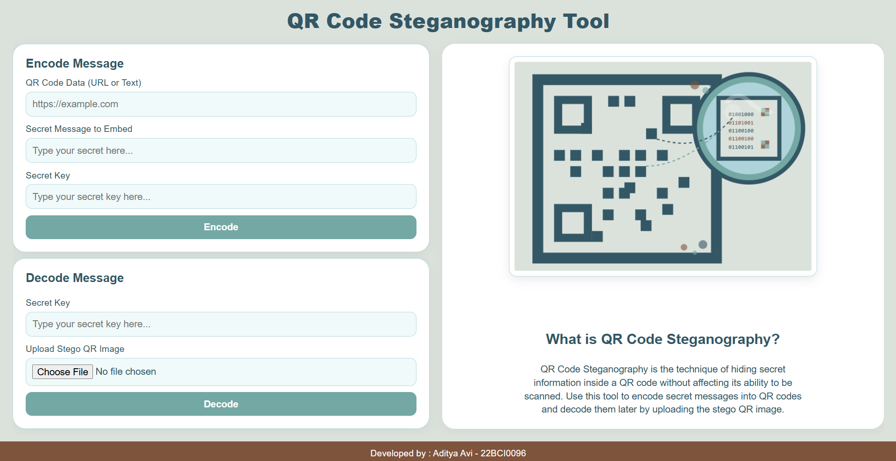

# QR Code Steganography using LSB (Least Significant Bit)

This project demonstrates how to embed a secret message into a QR code image using Least Significant Bit (LSB) steganography. It allows for secure hiding and retrieval of messages inside QR images.

## Features

- Generate QR codes from text input.
- Hide a secret message inside the QR image using LSB.
- Decode and retrieve the hidden message from the modified image.

### Prerequisites

Install the required Python libraries:

- `qrcode[pil]`
- `pillow`
- `numpy`

## How It Works

This project combines QR code generation with Least Significant Bit (LSB) steganography to hide secret messages inside QR images.

1. **QR Code Generation**  
   A QR code is created from user-provided text or a URL using the `qrcode` library. This image (`qr.png`) serves as the carrier.

2. **Message Encoding with LSB**  
   The secret message is converted to binary and embedded into the pixel data of the QR image by modifying the least significant bit of each pixel value. A special delimiter (`1111111111111110`) is added to indicate the end of the message.

3. **Saving the Stego Image**  
   The modified image, which visually looks the same as the original QR code, is saved as `stego_qr.png`.

4. **Message Decoding**  
   To retrieve the hidden message, the stego image is read and the least significant bits of the pixel data are extracted. The binary stream is then converted back to readable text, stopping at the delimiter.

This process ensures the QR code remains scannable while secretly carrying an additional message.

## Advantages

- Combines overt QR data with covert hidden messages using steganography.
- Error correction in QR codes allows minor modifications without breaking scanability.
- Stego QR codes appear visually unchanged, enhancing secrecy and stealth.
- Easily implemented using common Python libraries with minimal overhead.
